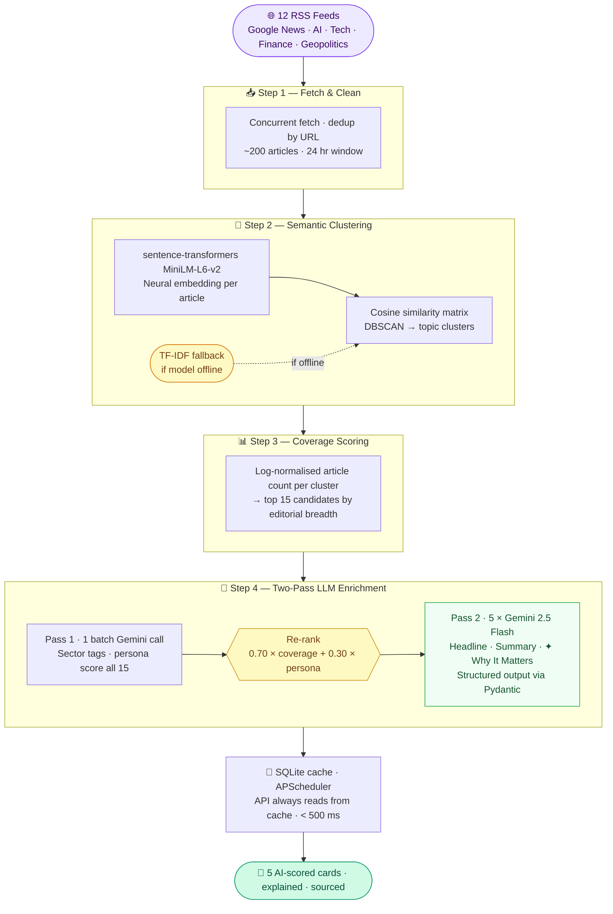
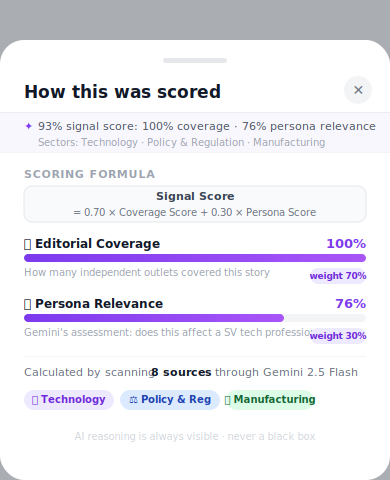

<div align="center" id="top">

<br>

# 📡 News That Matters

**An AI news intelligence engine that scores what's worth your attention — and explains exactly why**

<br>

[](https://python.org)
[](https://aistudio.google.com)
[](https://fastapi.tiangolo.com)
[](LICENSE)

<br>

### ▶ &nbsp;[Try the live prototype &nbsp;→](https://news-that-matters-um2s.onrender.com)

> Deployed on Render · loads in ~30 s on first visit (free tier cold start) · swipe the cards, tap ✦ Why It Matters, open the score breakdown sheet

### 🏢 &nbsp;[Internal demo (Walmart) &nbsp;→](https://puppy.walmart.com/sharing/a0d0ggy/news-that-matters)

> Static prototype hosted on puppy.walmart.com · no install needed · opens instantly in browser

<br>


<br><br>

</div>

---

## The idea

I read a lot of news. I retain almost none of it.

Not because I don't try — I have six apps, two newsletters, and a Slack channel full of links I'll never open. The problem isn't access to information, it's that nothing tells me *which* of the 200 articles published this morning is actually worth stopping for.

Most news apps solve discovery. None of them solve *prioritisation*.

So I built one that does. Every hour it scans 12 news feeds, clusters ~200 articles by topic, scores each cluster using a formula I designed (`0.70 × editorial coverage + 0.30 × relevance to a Silicon Valley professional`), and then asks Gemini to explain the top 5 in plain English — including exactly why each story matters to someone who works in tech.

The score is shown on every card. The inputs that produced it are shown too. The AI's reasoning is never a black box.

---

## How the intelligence is built

This is the part I'm most proud of. Not the UI — the pipeline that decides what you see before you ever open the app.



The key design decision is the **two-pass LLM architecture**. Most obvious approach: call Gemini 5 times on the top 5 stories by article count. The problem: coverage rank ≠ relevance rank. A story covered by 20 regional newspapers might score higher than a story covered by 8 major tech outlets — but the second story is probably more interesting to a Silicon Valley professional.

Pass 1 is a single cheap batch call that adds the persona dimension *before* selection. The right 5 stories get enriched in Pass 2. Total cost: 6 LLM calls instead of 5 — but the selection is meaningfully better.

---

## The scoring formula

Every card shows a score from 0–10. Here's exactly how it's calculated:

```
Signal Score = 0.70 × Coverage Score + 0.30 × Persona Score

Coverage Score  = log-normalised article count across 12 feeds
                  (how many independent outlets reported this?)

Persona Score   = Gemini's assessment of relevance to a
                  Silicon Valley tech professional
                  (does this materially affect their work, investments, or industry?)
```

These aren't hidden. They're on the card:

> **9.3 / 10** &nbsp;·&nbsp; 📡 8 src &nbsp;·&nbsp; 📰 100% cov &nbsp;·&nbsp; 🎯 76% match

When the AI gives a story a 9.3, you can see *why*: near-total editorial consensus (100% coverage) across sources that a Silicon Valley professional has high reason to care about (76% persona match). The formula is the product.

---

## What you see

**🔗 [Open the live prototype](https://news-that-matters-um2s.onrender.com)** — fully interactive, deployed on Render, free tier. First load may take ~30 seconds if the server is sleeping.

### The card

Each of the 5 daily cards is structured around the AI score, not the headline.

<div align="center">

</div>

<br>

The gradient changes with rank. The score level (EMERGING → BUILDING → URGENT → CRITICAL) changes with intensity. The two bars show you the two numbers that produced the score.

### The tabs

<div align="center">

</div>

<br>

**What Happened** is commodity — any news app can do this.

**✦ Why It Matters** is where the product earns its name. This tab isn't a summary. It's Gemini reading the full cluster of articles and generating *meaning* — specifically framed for a Silicon Valley professional. It answers: *given who you are and what you work on, why should you stop and care about this right now?* That contextualisation is the hardest part of reading the news, and the part no other app does. The tab is purple *even when inactive*, pulling your eye toward the AI's analysis before you've consciously decided to tap. That's not an accident.

### The breakdown sheet

Tap the `↗` chip and a sheet slides up explaining the AI's full reasoning: the exact coverage and persona scores, the sector classification, and the formula that combined them into the number on your card.

<div align="center">

</div>

<br>

This exists because I think AI products should be accountable to their own reasoning. If the AI says a story scores 9.3, the user deserves to know why — not as a disclaimer buried in a settings page, but as a first-class feature one tap away.

---

## The decisions that shaped it

<details>
<summary><b>Why show the AI's inputs on the card — not just the score?</b></summary>

<br>

The temptation with any AI-scored product is to show the output and hide the inputs. It feels cleaner. It also feels like magic, which sounds good until users start asking "why is this a 9?" and the answer is "we can't tell you."

I made the opposite call. Every card shows coverage percentage and persona match percentage — the two numbers that produced the score. The formula is printed in the breakdown sheet. Anyone can read it.

The reason isn't ethics-washing. It's trust. If a user sees a 9.3 and doesn't understand why, they'll start second-guessing every score. If they see "100% cov · 76% match" and they know what those mean, they understand the AI's reasoning instantly — and they trust or challenge it from an informed position. That's a better relationship between a user and an AI product.

Transparency by design, not by disclaimer.

</details>

<details>
<summary><b>Why 70/30 — and not 50/50 or 90/10?</b></summary>

<br>

This was the hardest product decision in the whole build.

Pure editorial coverage (100/0) surfaces stories that are everywhere — which often means they're already on everyone's phone. High coverage just means "a lot of outlets reported this," not "this is important to you specifically." The risk is a brief that looks like a slow version of Google News.

Pure persona relevance (0/100) means trusting Gemini to completely override what the media is covering. That introduces LLM bias and misses legitimately important stories that Gemini didn't flag as personally relevant.

70/30 was a deliberate starting point: editorial coverage is the anchor (these things are objectively widely covered), persona relevance is the differentiator (here's why *you* should care). The weighting is visible to users and documented in ADR-022. If I had telemetry, I'd A/B test 60/40 against it.

</details>

<details>
<summary><b>Why two-pass LLM instead of just calling Gemini 5 times?</b></summary>

<br>

The naive approach is: take the top 5 stories by article count, call Gemini once per story, enrich them. Simple, parallel, cheap enough.

The problem I hit: coverage rank and relevance rank don't always agree. Story A might have 40 articles from regional outlets. Story B might have 12 articles from major tech publications. Step 3 ranks Story A higher. But for a Silicon Valley professional, Story B is almost certainly more interesting.

Pass 1 fixes this. It's a single batch LLM call — cheap, fast — that scores all 15 candidate clusters for persona relevance *before* final selection. The re-rank happens at that point. Pass 2 enriches the correctly-selected top 5.

The cost: 1 extra LLM call. The benefit: the right 5 stories in the brief every time. That's not a hard trade-off.

</details>

<details>
<summary><b>Why DBSCAN instead of k-means for clustering?</b></summary>

<br>

k-means requires you to specify k — the number of clusters — upfront. For 200 daily articles, there's no principled way to know whether today's news breaks into 15 clusters or 35. Forcing k = 20 means some stories get merged that shouldn't be, and others get artificially split.

DBSCAN discovers the number of clusters from the data. It groups articles that are within a cosine distance threshold of each other, and marks everything else as noise (one-off articles that don't cluster). For daily news — where the number of distinct stories genuinely varies day to day — that's the right choice.

The TF-IDF fallback exists because `sentence-transformers` requires a network download on first run, and I wanted the pipeline to work even on a machine with no internet access (or restricted Walmart VPN). TF-IDF is surprisingly effective for news clustering because same-event articles share proper nouns — names, tickers, legislation — which are exactly what TF-IDF weights highest.

</details>

---

## Tech stack

| Layer | Technology |
|-------|-----------|
| **LLM** | Google Gemini 2.5 Flash · 1.5 Flash · 1.5 Flash-8B (3-tier fallback) |
| **Embeddings** | `sentence-transformers` all-MiniLM-L6-v2 · TF-IDF fallback |
| **Clustering** | scikit-learn DBSCAN · cosine similarity |
| **Backend** | FastAPI · SQLite · APScheduler · Pydantic |
| **Frontend** | Vanilla JS + CSS · Inter · Plus Jakarta Sans |
| **Data** | Google News RSS (12 feeds) · feedparser |
| **Built with** | Code Puppy (AI dev agent) · Gemini API |

---

## Run it locally

```bash
# Clone
git clone https://github.com/YOUR_USERNAME/news-that-matters.git
cd news-that-matters

# Install
python -m venv .venv && source .venv/bin/activate
pip install -r requirements.txt

# Add your Gemini key (free at aistudio.google.com)
echo "GEMINI_API_KEY=your_key_here" > .env

# Run
uvicorn app.main:app --port 8001

# Open
open http://localhost:8001
```

The pipeline runs automatically on first boot (~30 seconds), then hourly in the background. **No key?** The app falls back to a built-in static brief — still fully interactive, just not live data.

---

## Architecture decisions

25 decision records live in [`DECISIONS.md`](DECISIONS.md) — written in the style of a production engineering team. Topics include why DBSCAN over k-means (ADR-013), why TF-IDF as fallback (ADR-013), why the 70/30 formula (ADR-022), the two-pass LLM architecture (ADR-023), and why the timeline feature was cut (ADR-024).

The ADR format forces a discipline I think all AI product decisions should have: *state the context, state the options considered, state what you chose and why.* "We used Gemini" is not an architecture decision. "We use Gemini 2.5 Flash as primary, with automatic fallback to 1.5 Flash then 1.5 Flash-8B, because the free API tier has daily token limits and the pipeline must never fail silently" is.

---

## What I'd do next

This is a versioned roadmap — each version has a clear job to do before the next one starts.

### V1 · AI-powered geopolitical news trend analyzer ✅ *shipped*
**[▶ Try it live](https://news-that-matters-um2s.onrender.com)** · The current build. 12 RSS feeds → semantic clustering → two-pass LLM scoring → 5 scored cards per day with full AI reasoning visible on every card. The core thesis proven: coverage breadth × persona relevance produces a meaningfully better signal than either dimension alone.

### V2 · System health monitoring and reliability
A pipeline that fails silently is worse than one that doesn't run at all. V2 adds a `/health` endpoint with structured pipeline state, alerting if a run exceeds 4 minutes or produces fewer than 3 clusters, retry logic with exponential backoff on LLM quota errors, and a stale-data banner in the UI when the last successful brief is over 2 hours old. The goal: make failure loud, not invisible.

### V3 · Evaluation framework for ranking and summarization quality
Right now the 70/30 formula is a reasoned starting point, not a measured optimum. V3 builds the eval harness to find out if it's right — human-labeled relevance ground truth for 30 days of briefs, automated summarization quality metrics (BERTScore against source articles), and an A/B test runner for formula weight variants (60/40, 80/20). The question V3 answers: is the AI actually picking the right 5 stories?

### V4 · Observability layer for debugging and explainability
When the pipeline picks story A over story B, why? V4 adds structured scoring traces logged per-run — every cluster's coverage score, persona score, re-rank delta, and final position — stored in SQLite alongside the brief. A diff view shows what changed between today's brief and yesterday's. The score breakdown sheet in the UI deepens to show the full trace. The goal: make the AI's reasoning inspectable by anyone, not just the person who wrote the prompt.

---

<div align="center">

Built by **[Astha Dhawan](https://www.linkedin.com/in/asthadhawan)** · Staff Product Manager at Walmart

[](https://www.linkedin.com/in/asthadhawan)
&nbsp;
[](https://github.com/Anoniehere)

<br>

*If this made you think differently about how AI products should reason — a ⭐ goes a long way.*

</div>
